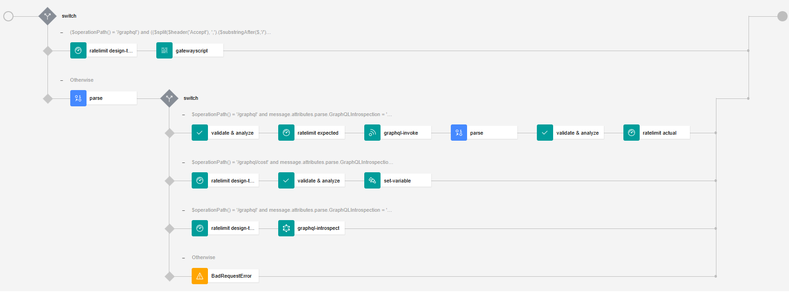
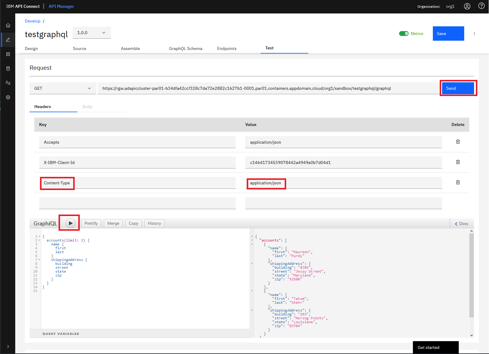
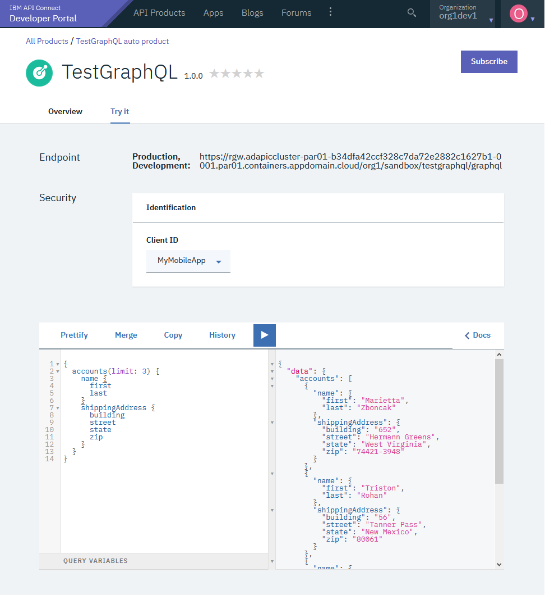
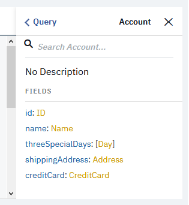

GraphQL in API Connect

**WORK IN PROGRESS**

# Introduction
At its simplest, GraphQL is about asking for specific fields on objects.

Specifications
https://graphql.org

## Terminology
* **Queries** for reads (get data)
* **Mutations** for writes (create data)

# Simple Test
## Create a GraphQL API
Add API select graphql
Enter the following  info
name: testgraphql
GraphQL server url: https://graphql-test-server.us-east.cf.appdomain.cloud/accounts/graphql
Click next will get the schema (Warning 2 things dangerous)

assembly-pannel

## Using the Test and Debug panel
Update the endpoint
https://rgw.adapiccluster-par01-b34dfa42ccf328c7da72e2882c1627b1-0001.par01.containers.appdomain.cloud/org1/sandbox/testgraphql/graphql

```
{
  accounts(limit: 3) {
    name {
      first
      last
    }
    shippingAddress {
      building
      street
      state
      zip
    }
  }
}
```



## In Portal


Very practical the schema explorer (Documentation explorer) helps you to build the queries and the mutations in a very efficient way.



## With curl
```
curl -k -H "Accept: application/json" -H "Content-Type: application/json" -H "X-IBM-Client-Id: 7ce2a087bbd75e465f0096054d5d3e58" -d "{\"query\": \"{accounts(limit: 3) {name {first last}shippingAddress {building street state zip}}}\", \"variables\": null}" https://rgw.adapiccluster-par01-b34dfa42ccf328c7da72e2882c1627b1-0001.par01.containers.appdomain.cloud/org1/sandbox/testgraphql/graphql |jq .
  % Total    % Received % Xferd  Average Speed   Time    Time     Time  Current
                                 Dload  Upload   Total   Spent    Left  Speed
100   548    0   433  100   115    433    115  0:00:01 --:--:--  0:00:01   975
{
  "data": {
    "accounts": [
      {
        "name": {
          "first": "Owen",
          "last": "Dickinson"
        },
        "shippingAddress": {
          "building": "02",
          "street": "Milton Manor",
          "state": "Vermont",
          "zip": "44252"
        }
      },
      {
        "name": {
          "first": "Anibal",
          "last": "Bednar"
        },
        "shippingAddress": {
          "building": "130",
          "street": "Morissette Lane",
          "state": "Iowa",
          "zip": "82624"
        }
      },
      {
        "name": {
          "first": "Mckayla",
          "last": "Rath"
        },
        "shippingAddress": {
          "building": "638",
          "street": "Jazmyn Street",
          "state": "Nevada",
          "zip": "39995"
        }
      }
    ]
  }
}
```
# Introspect the GraphiQL schema

# Securing GraphQL queries
## Authentication and quotas
Traditional API Security

## Gest the cost with curl
The "cost" does not relate purely to monetary cost but can take into account factors such as computational time, memory consumption, and other such factors, in addition to the actual financial costs associated with, say, using third-party systems to retrieve data.

```
curl -k -H "Accept: application/json" -H "Content-Type: application/json" -H "X-IBM-Client-Id: 7ce2a087bbd75e465f0096054d5d3e58" -d "{\"query\": \"{accounts(limit: 3) {name {first last}shippingAddress {building street state zip}}}\", \"variables\": null}" https://rgw.adapiccluster-par01-b34dfa42ccf328c7da72e2882c1627b1-0001.par01.containers.appdomain.cloud/org1/sandbox/testgraphql/graphql/cost | jq .
  % Total    % Received % Xferd  Average Speed   Time    Time     Time  Current
                                 Dload  Upload   Total   Spent    Left  Speed
100   344    0   229  100   115    229    115  0:00:01 --:--:--  0:00:01  2752
{
  "fieldCost": 2147483647,
  "typeCost": 2147483647,
  "typeCounts": {
    "Account": 2147483647,
    "Address": 2147483647,
    "Name": 2147483647,
    "Query": 1
  },
  "fieldCounts": {
    "Account.name": 2147483647,
    "Account.shippingAddress": 2147483647,
    "Query.accounts": 1
  }
}
```


# Understanding API Event with GraphQL information
