GraphQL in API Connect

**WORK IN PROGRESS**

https://ec.yourlearning.ibm.com/w3/series/10101939?layout=grid


# Introduction
At its simplest, GraphQL is about asking for specific fields on objects.
Interest is growing significantly in 2109and  2020

Problems solved by GraphQL API
* They help reduce the number of versions for an API
* Reduce the number of API calls required so improve significantly performances
* Reduce the amount of fetched data

Specifications
https://graphql.org

Implementations
The JavaScript reference implementation for GraphQL, a query language for APIs created by Facebook. https://www.npmjs.com/package/graphql
List of popular server-side frameworks, client libraries, services, ... https://graphql.org/code/
80000+ repositories on GraphQL: https://github.com/search?q=graphql
Create  queries for the data you need to integrate with GitHub https://docs.github.com/en/graphql

Available in many languages.

## Terminology and concepts
A query language And a runtime to fulfill queries
## REST versus GraphQL
Only one URL
Use POST (or GET with JSON **like** payload as parameter)

There is a content-type called application/graphQL


* **Queries** for reads (get data)
Ask for data
Ask for many parts at once
Ask for only the parts you want

## Slicing/paging
max, limit, first, last
offset, cursor (advanced feature)


 * **Mutations** for changing the data
Modify the data - create/modify/delete (CUD)
Query the resulting data
Ask for many mutations at once
Query only the parts you need

* **subscriptions** (usually over websockets) (Not supported in APIC V10.0.0.0)
Subscribe to long-lived pub-sub stream of events
Query each event
Only once
Query only the parts you need

Notions of variables
{"a":"b"}
Notions of OperationName
operationName as a query parameters or inside the Query


**Introspections queries** get data types and operations a GraphQL server offers.
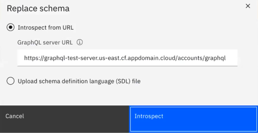

Client learns (automatically) about the data types and operations a GraphQL serve offers
It is a GraphQL query. It is just an extract.
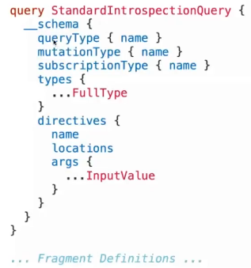
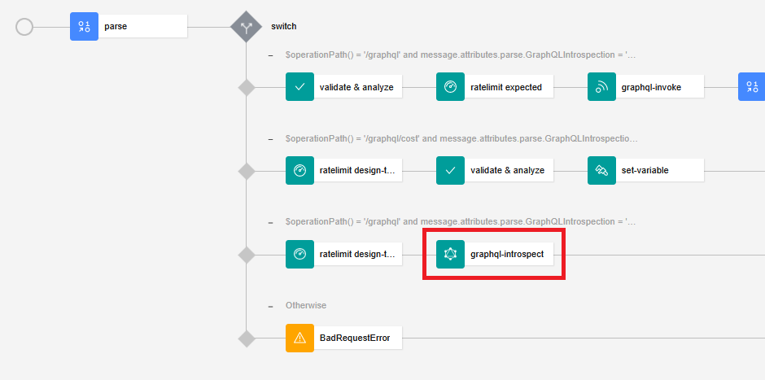

The introspection policy is used for
* Eliminates the need to invoke backend for Introspection Response
* Use the schema published by the API developer instead of the schema from the backend
* Protect sensitive information from being revealed in the Portal
* Provides information regarding Introspection
* Improve performances

Popular and growing popularity. Downloads from npm doubling every your learning (GraphQL faster than npm). From Netflix 1000 a week.
Lots of language implementations
C#/.NET, Clojure, Elixir, Go, Groovy, Java, JavaScript, Julia, Katlin, Perl, PHP, Python, R, Ruby, Scala, Swift, OCaml/Reason

Solve usability and performance problems when accessing or changing data. And also versions, with too many API to provide support. Client wants new form of data from server.
The client is always right :-)

Support nested queries do not need a join like in SQL.

GitHub has two API V3 REST based API, V4 GraphQL API (195 kB versus 2.2 kB for example/ 24 requests versus 1 request)
https://developer.github.com/v4/explorer

```
query {
  repository(owner: "graphql", name: "graphql-js"){
    name
    description
  }
  viewer {
    login
  }
}
```

Sample mutation
Create an account and return me the id
Request:
```
mutation {
  addAccount(input: {id: 123, name: {first: "John", last: "Doo"}}) {
    id
  }
}
```
Response
```
{
  "data": {
    "addAccount": {
      "id": "123"
    }
  }
}
```

Sample subscription (Not in V10.0.0.0)
Give me the name and date of creation of all new repository created
```
subscription {
  newRepository {
    repository {
      name
      createdAt
    }
  }
}
```


# Simple Test
## Create a GraphQL API
Wizard Add API
Select From Existing GraphQL service (GraphQL proxy)


Add API select graphql
Enter the following  info
name: testgraphql
base path:
GraphQL server url: https://graphql-test-server.us-east.cf.appdomain.cloud/accounts/graphql (Best practice ends with graphql,only one end point)
Click next will get the schema (Warning 2 things dangerous)
This is the namespace name I just want to provide in my YAML (for example accounts)

When clicking Next it went to the GraphQL server and introspected the service.
You have the opportunity to decide what you want to expose.
rename the termination endpoint (not a good idea)
Support introspection, provide access to the GraphiQL editor
Expose or not the cost endpoint for a client.

In the next panel, you have the opportunity to uncheck the use of the client_id, there is a link that explains how to not use the client id. obviously the most standard approach and usual one is to use client_id

We can see in the GraphQL schema tab the schema that has been introspected
On the assembly what has been generated
We can see the various treatments (invoke, introspect, cost) and all the actions are explained

Cost is calculated by the analyzer (displayed in the assembly panel)
Over-estimating cost means rejecting good transactions
Under-estimating increase risks by not limiting dangerous transactions

assembly-panel

In the test panel, for the GraphiQL editor
We find the history, the request , the response and the documentations/schemas information

In Request: type ahead, real time error highlighting

In the trace part, we can see all the debug information

Do not need the introspection, because it is included in the GraphiQL editor.


The parse action is a standard DataPower action.
It has now a GraphQL document type
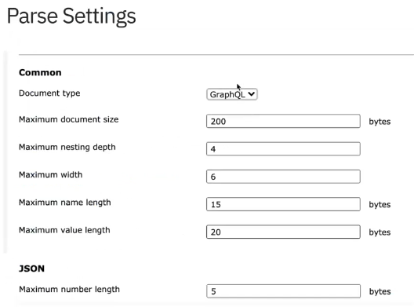

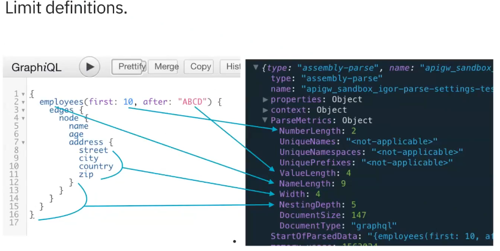


Parse description for graphql-input-type-cost (To be checked)
| Attribute      | description |
|----------------|------------ |
| use-app-id:    | false       |
| dynamic-value: | ''          |
| weight:        | >-          |
| is-client:     | true        |
| value:         | 1000/1hour  |
| use-client-id: | false       |
| cache-only:    | true        |
| use-api-name:  | false       |
| hard-limit:    | true        |

## Using the Test and Debug panel
Update the endpoint
https://rgw.adapiccluster-par01-b34dfa42ccf328c7da72e2882c1627b1-0001.par01.containers.appdomain.cloud/org1/sandbox/testgraphql/graphql

```
{
  accounts(limit: 3) {
    name {
      first
      last
    }
    shippingAddress {
      building
      street
      state
      zip
    }
  }
}
```

Another sample with filter (https://countries.trevorblades.com/)
```
{
  continents(filter: { code: { eq: "AN" } }) {
    code
    name
    countries {
      code
      name
      capital
      languages {
        name
      }
    }
  }
}
```


## In Portal


Very practical the schema explorer (Documentation explorer) helps you to build the queries and the mutations in a very efficient way.


## GraphQL voyager
API Guru Voyager https://apis.guru/graphql-voyager/
Using the SDL from https://countries.trevorblades.com/

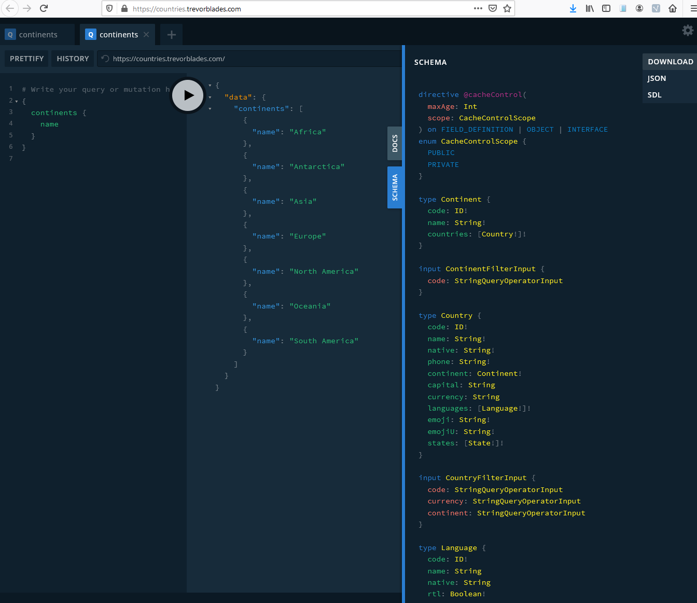

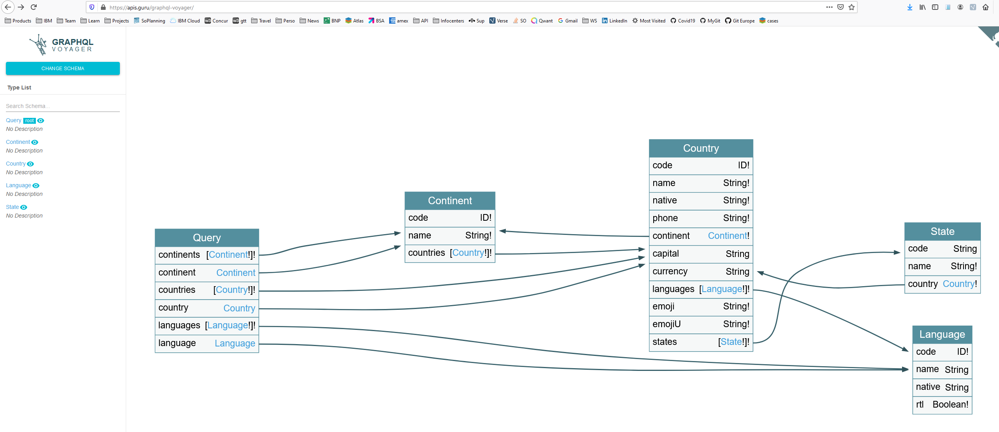

```
{
  continents {
    name
    countries {
      name
      continent {name}
    }
  }
}
```


## With curl
```
curl -k -H "Accept: application/json" -H "Content-Type: application/json" -H "X-IBM-Client-Id: 7ce2a087bbd75e465f0096054d5d3e58" -d "{\"query\": \"{accounts(limit: 3) {name {first last}shippingAddress {building street state zip}}}\", \"variables\": null}" https://rgw.adapiccluster-par01-b34dfa42ccf328c7da72e2882c1627b1-0001.par01.containers.appdomain.cloud/org1/sandbox/testgraphql/graphql |jq .
  % Total    % Received % Xferd  Average Speed   Time    Time     Time  Current
                                 Dload  Upload   Total   Spent    Left  Speed
100   548    0   433  100   115    433    115  0:00:01 --:--:--  0:00:01   975
{
  "data": {
    "accounts": [
      {
        "name": {
          "first": "Owen",
          "last": "Dickinson"
        },
        "shippingAddress": {
          "building": "02",
          "street": "Milton Manor",
          "state": "Vermont",
          "zip": "44252"
        }
      },
      {
        "name": {
          "first": "Anibal",
          "last": "Bednar"
        },
        "shippingAddress": {
          "building": "130",
          "street": "Morissette Lane",
          "state": "Iowa",
          "zip": "82624"
        }
      },
      {
        "name": {
          "first": "Mckayla",
          "last": "Rath"
        },
        "shippingAddress": {
          "building": "638",
          "street": "Jazmyn Street",
          "state": "Nevada",
          "zip": "39995"
        }
      }
    ]
  }
}
```
# Introspect the GraphiQL schema

# Securing GraphQL queries

Edit the schema for protection


## Authentication and quotas
Traditional API Security

## Gest the cost with curl
The "cost" does not relate purely to monetary cost but can take into account factors such as computational time, memory consumption, and other such factors, in addition to the actual financial costs associated with, say, using third-party systems to retrieve data.

Need to ask the backend to assess the various cost on the backend

This is a static analysis
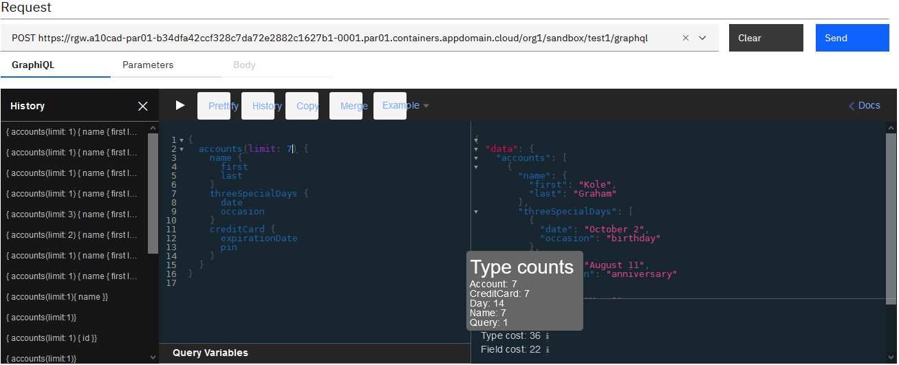


Changing the type cost.
Changing the field cost. Cost will be based by the resolver implementation. The person writing the resolvers knows the cost of each resolver.
Cost may represent CPU, latency, money cost

Cost is calculate using gateway peering (not SLM), usual behavior for API Connect.
GraphQL rates limits: cost per second
Consume and Replenish
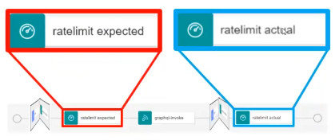
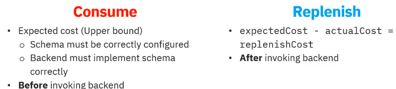
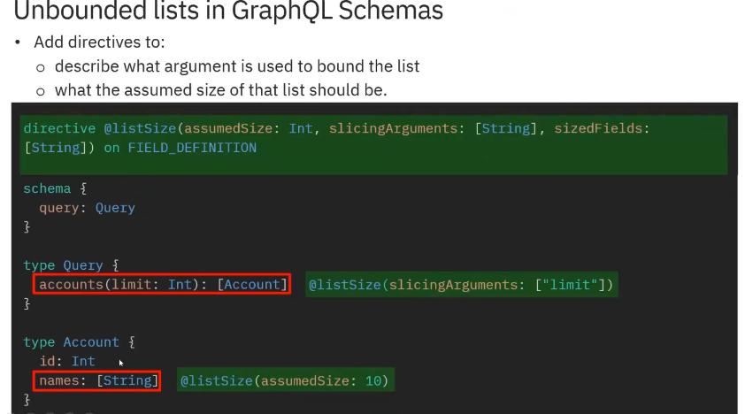

## Cost calculation
Bulk feature to edit more than one field at a time
Search/filter

### Handling lists
List size:
* assumed-size in the schema, allow to calculate correctly the type size
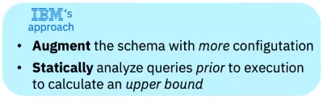
* unbound ListSize will provide wrong number if nothing is done
GraphQL help with slicing. Even if the schema does not provide any information on it.
In real world nobody return unbound lists

The result may have less.


```
curl -k -H "Accept: application/json" -H "Content-Type: application/json" -H "X-IBM-Client-Id: 7ce2a087bbd75e465f0096054d5d3e58" -d "{\"query\": \"{accounts(limit: 3) {name {first last}shippingAddress {building street state zip}}}\", \"variables\": null}" https://rgw.adapiccluster-par01-b34dfa42ccf328c7da72e2882c1627b1-0001.par01.containers.appdomain.cloud/org1/sandbox/testgraphql/graphql/cost | jq .
  % Total    % Received % Xferd  Average Speed   Time    Time     Time  Current
                                 Dload  Upload   Total   Spent    Left  Speed
100   344    0   229  100   115    229    115  0:00:01 --:--:--  0:00:01  2752
{
  "fieldCost": 2147483647,
  "typeCost": 2147483647,
  "typeCounts": {
    "Account": 2147483647,
    "Address": 2147483647,
    "Name": 2147483647,
    "Query": 1
  },
  "fieldCounts": {
    "Account.name": 2147483647,
    "Account.shippingAddress": 2147483647,
    "Query.accounts": 1
  }
}
```

## Edges
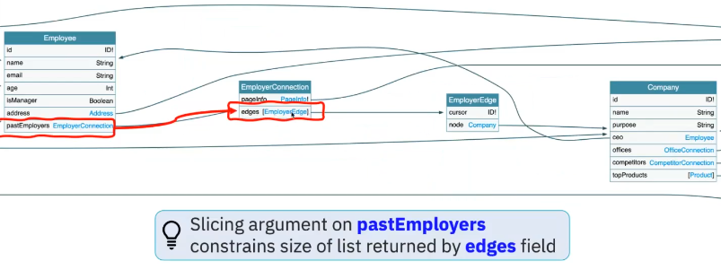
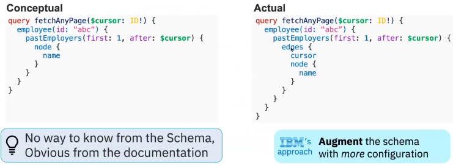

## A word on caching
Caching very difficult with GraphQL (Major issue)
use of POST, subset may have changed, etc ...
In the future APIC Gateway may try to do something

# Understanding API Event with GraphQL information


{ __schema { queryType { name } } }

curl -k -v "https://graphql-test-server.us-east.cf.appdomain.cloud/accounts/graphql?query=%7B%20__schema%20%7B%20queryType%20%7B%20name%20%7D%20%7D%20%7D"

{ __type(name: "Query") { name } }
curl -k -v "https://graphql-test-server.us-east.cf.appdomain.cloud/accounts/graphql?query=%7B%20__type(name%3A%20%22Query%22)%20%7B%20name%20%7D%20%7D"

{ __type(name: "account") { name } }
curl -k -v "https://graphql-test-server.us-east.cf.appdomain.cloud/accounts/graphql?query=%7B%20__type(name%3A%20%22account%22)%20%7B%20name%20%7D%20%7D"

curl 'https://countries.trevorblades.com/' -H 'Accept-Encoding: gzip, deflate, br' -H 'Content-Type: application/json' -H 'Accept: application/json' -H 'Connection: keep-alive' -H 'DNT: 1' -H 'Origin: https://countries.trevorblades.com' --data-binary '{"query":"# Write your query or mutation here\n{continents{name}}"}' --compressed

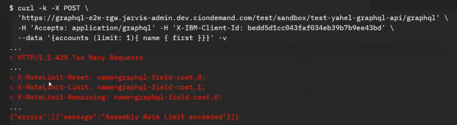
